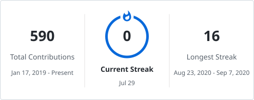

[](https://www.linkedin.com/in/maf345)

<div align="center">

**Turning complex data into clear decisions** · Dhaka, Bangladesh 🇧🇩

<table>
<tr>
<td align="center"><a href="https://www.linkedin.com/in/maf345"></a></td>
<td align="center"><a href="https://github.com/ybg345"></a></td>
<td align="center"><a href="https://www.kaggle.com/maf345"></a></td>
<td align="center"><a href="https://www.hackerrank.com/ybg345"></a></td>
</tr>
<tr>
<td colspan="4" align="center"></td>
</tr>
</table>

</div>

---

## 📖 𝙰𝚋𝚘𝚞𝚝 𝙼𝚎

- 📊 **Senior Data Analyst** with **7+ years** across healthcare, telecom, and microinsurance
- 🏗️ 𝙸 𝚍𝚎𝚜𝚒𝚐𝚗 **dashboards**, **data pipelines**, and **agentic AI workflows** — Snowflake · Tableau · LLMs
- 💼 𝙲𝚞𝚛𝚛𝚎𝚗𝚝𝚕𝚢 𝚊𝚝 **Streams Tech Ltd.**, building healthcare AI and enterprise analytics for global clients
- 🎓 **B.Sc. CSE** — Military Institute of Science and Technology (MIST)

---

## ⬆ 𝚆𝚑𝚊𝚝 𝙸'𝚖 𝚞𝚙 𝚝𝚘

- 🔨 𝙸'𝚖 𝚌𝚞𝚛𝚛𝚎𝚗𝚝𝚕𝚢...

```yaml
- Building agentic AI workflows for healthcare (LangChain, LLM evaluation)
- Developing analytics dashboards on Snowflake datamarts & IQVIA Orchestrated Analysis
- Maintaining Tableau Server dashboards with cloud data warehouse backends
```

---

## 🎓 𝙲𝚎𝚛𝚝𝚒𝚏𝚒𝚌𝚊𝚝𝚒𝚘𝚗𝚜

<table>
<tr>
<td align="center"><a href="https://www.linkedin.com/in/maf345"></a></td>
<td align="center"><a href="https://www.kaggle.com/learn/certification/maf345/intermediate-machine-learning"></a></td>
<td align="center"><a href="https://www.hackerrank.com/certificates/ee3617078666"></a></td>
<td align="center"><a href="https://www.datacamp.com/"></a></td>
</tr>
</table>

---

## 🛠 𝚃𝚎𝚌𝚑 𝚂𝚝𝚊𝚌𝚔

<table>
<tr>
<td align="center"></td>
<td align="center"></td>
<td align="center"></td>
<td align="center"></td>
<td align="center"></td>
</tr>
<tr>
<td align="center"></td>
<td align="center"></td>
<td align="center"></td>
<td align="center"></td>
<td align="center"></td>
</tr>
</table>

---

## 📈 𝙶𝚒𝚝𝙷𝚞𝚋 𝚂𝚝𝚊𝚝𝚜

<div align="center">

<table>
<tr>
<td width="400" align="center" valign="top"></td>
<td width="400" align="center" valign="top"></td>
</tr>
</table>



</div>

---

## 🏆 𝙶𝚒𝚝𝙷𝚞𝚋 𝚃𝚛𝚘𝚙𝚑𝚒𝚎𝚜

<div align="center">

</div>

---

<div align="center">

𝙳𝚊𝚝𝚊 𝚝𝚎𝚕𝚕𝚜 𝚊 𝚜𝚝𝚘𝚛𝚢 — 𝚖𝚢 𝚓𝚘𝚋 𝚒𝚜 𝚝𝚘 𝚖𝚊𝚔𝚎 𝚒𝚝 𝚛𝚎𝚊𝚍𝚊𝚋𝚕𝚎, 𝚛𝚎𝚕𝚒𝚊𝚋𝚕𝚎, 𝚊𝚗𝚍 𝚊𝚌𝚝𝚒𝚘𝚗𝚊𝚋𝚕𝚎.

</div>
